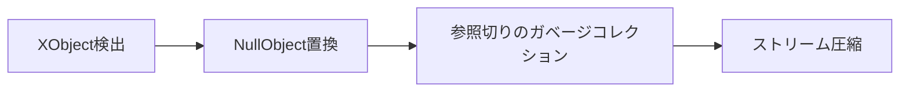

# PDF Image Remover & Compressor 🔖✂️

[](https://www.python.org/)

PDFファイルから画像を完全削除しつつテキスト構造を保持するPythonツール。機密画像の除去やファイル軽量化に最適です。

## 🚀 特徴
- **画像完全削除** - XObjectを検出しNullObjectで置換
- **スマート圧縮** - pikepdfによるストリーム最適化
- **メタデータ保持** - テキスト検索可能な状態を維持
- **バッチ処理対応** - フォルダ単位での一括処理
- **ハイブリッド処理** - PyPDF2とpikepdfの併用

## ⚙️ 動作環境
- Python 3.8+
- 依存パッケージ:
  ```bash
  PyPDF2==3.0.0
  pikepdf==8.2.0

# インストール
```bash
git clone https://github.com/yourusername/pdf-image-remover.git
cd pdf-image-remover
python -m venv venv
source venv/bin/activate  # Windows: venv\Scripts\activate
pip install -r requirements.txt
```
# 使用方法
## 基本コマンド
```bash
python pdf_image_remover.py 入力ファイル.pdf 出力ファイル.pdf
```
# 実用例
```bash
# 単一ファイル処理
python pdf_image_remover.py document.pdf compressed_document.pdf

# フォルダ一括処理（bash/zsh）
for file in ./documents/*.pdf; do
  python pdf_image_remover.py "$file" "./output/compressed_${file##*/}"
done
```
# 技術的詳細
### 画像削除のメカニズム

- NullObject置換の特性:
  - PDF仕様上「存在しないオブジェクト」としてマーク
  - ビューアによっては警告表示が発生するが、通常の表示/印刷は可能
  - Adobe Acrobat: 「無効なオブジェクトが含まれています」警告（表示は継続）
  - Chrome PDF Viewer: エラー表示なしで通常表示

# 想定ユースケース
 - ✅ 機械翻訳システムへのアップロード前処理
 - ❌ 印刷用原稿データ（DTP処理が必要なケース）

⚠️ 注意事項
- DTP用途不向き：
```diff
- 印刷会社へ入稿する原稿データとしては非推奨
+ NullObjectはPDF仕様上「存在しないオブジェクト」を示すため
+ RIP処理でエラーが発生する可能性が高い
```
- メタデータ整合性
```bash
処理前: オブジェクト参照が相互リンク
処理後: 参照切れオブジェクトが残留（ファイル構造の断片化）
```

- レイアウト崩れが発生する可能性（特に複雑なテーブルを含むPDF）
- 対応できないケース:
  - 暗号化されたPDF
  - 画像がテキストとして埋め込まれている場合
  - 透明効果を使用した図形
- 重要なファイルは必ずバックアップを取ってから実行

❓ FAQ
Q: 画像以外の要素は削除されますか？
A: テキスト、ベクター図形、注釈などは保持されます

Q: 処理時間の目安は？
A: 平均的な文書（10ページ程度）で約2-5秒

Q: 元のPDFに戻せますか？
A: 本ツールは非破壊処理ではありません。必ず元ファイルを保持してください

Q: 印刷会社から「データ不備」と指摘されました
A: 本ツールで生成したPDFは印刷用原稿として不適切です。

Q: エラーメッセージが表示されますが問題ありませんか？
A: 以下の条件下であれば実用上問題ありません：
- 最終出力がデジタル閲覧用
- 印刷がオフィスプリンター限定
